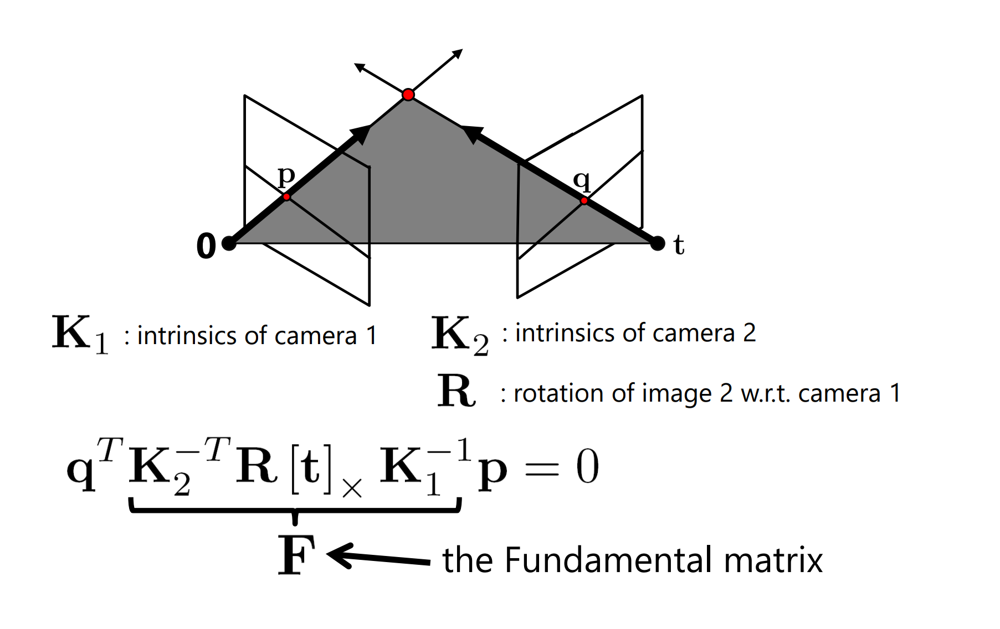
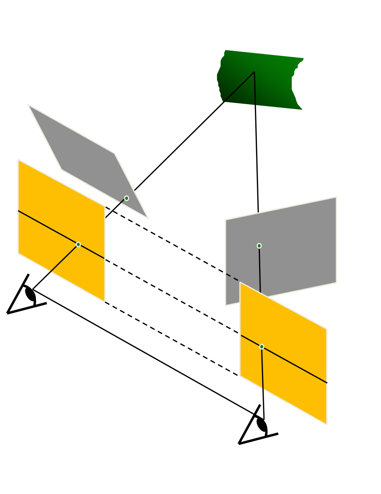

## Assignment #03 - Implement a script with Python and OpenCV that computes a depth map from at least three images. Write a readme file that explains what you have done and how to run the script and what the script does.

## About this Assignment

In this project the user can generate a depth map from three images. 

### Built with

Python: 3.10.2 <br>
Opencv: 4.5.5 <br> 
Numpy: 1.22.3

### Getting started

If everything is installed the user should clone this repository and run this Assignment. 
Before running it, he has to add three images to the folder 'images'. This images should display the
same content from other views. 
There are three example images included. 


### Usage

The first step the program does is finding feature points between two images with SIFT. <br>
Then this feature points between this two images can be displayed. 
Next step is the calculation of the fundamental matrix F. 


<!--  -->

```python
fundamental_matrix, inliers = cv2.findFundamentalMat(points1, points2, cv.FM_RANSAC)
```

With this information the user can display the epipolar lines if he wants to. 
This function is can be called by

```python
visualize_epilines(image1, image2, points1, points2, fundamental_matrix)
```

If everything worked fine the images can be rectified. The rectification rotates and translates the images. <br>


With the rectified images the disparity map can be generated.
```python
rectifyImages(image1, image2, points1, points2, fundamental_matrix)
calculate_disparity_map(image1_rectified, image2_rectified)
```

Last but at least: generate a disparity map from more than two images: <br>
For this step the program adds all disparity images and take the mean value of them.
